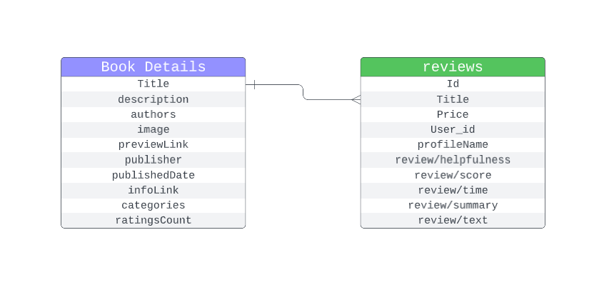

# Amazon books coldstart - project report

## Table of contents
- [Amazon books coldstart - project report](#amazon-books-coldstart---project-report)
  - [Table of contents](#table-of-contents)
  - [Problem description](#problem-description)
    - [Dataset](#dataset)
    - [Problem statement](#problem-statement)
    - [Metrics RZEPA](#metrics-rzepa)
      - [Ways to compute metrics](#ways-to-compute-metrics)
      - [Dataset](#dataset-1)
      - [How many users to query](#how-many-users-to-query)
  - [Methods (idea)](#methods-idea)
      - [First model idea RZEPA](#first-model-idea-rzepa)
      - [Second model idea RZEPA](#second-model-idea-rzepa)
    - [Book embeddings model](#book-embeddings-model)
  - [Description of the implementation (details)](#description-of-the-implementation-details)
    - [First model idea RZEPA](#first-model-idea-rzepa-1)
      - [Simple\_approach RZEPA](#simple_approach-rzepa)
      - [Book\_embedding\_approach RZEPA](#book_embedding_approach-rzepa)
    - [Second model idea RZEPA](#second-model-idea-rzepa-1)
      - [User\_embeddings](#user_embeddings)
      - [User\_embeddings2](#user_embeddings2)
      - [User\_embeddings3](#user_embeddings3)
    - [FAISS](#faiss)
    - [Model embeddings and training](#model-embeddings-and-training)
  - [Results](#results)
    - [Detailed results RZEPA](#detailed-results-rzepa)
    - [Summary RZEPA](#summary-rzepa)
    - [Conclusions RZEPA](#conclusions-rzepa)
    - [Perspectives](#perspectives)

## Problem description

### Dataset

We use [Amazon Books Reviews](https://www.kaggle.com/datasets/mohamedbakhet/amazon-books-reviews?resource=download) dataset from Kaggle.

Here are short reports generated by `pandas-profiling` library:
* [Books](./Books_report.html)
* [Reviews](./Ratings_report.html)

Links to report notebooks, dataset description

### Problem statement

We decided to tackle the 'cold start' problem. Read more on [Wikipedia](https://en.wikipedia.org/wiki/Cold_start_(recommender_systems)#New_item). Given a new book, we want to recommend it to users that will actually read it. It's not a trivial problem because we can use only book's metadata.

### Metrics RZEPA
Problem task: given book predict users that will read it.

We use a few metrics build from a few blocks described below. First has 2 possibilities, second 3 possibilities and third 2 possibilities what gives 12 values in total. We report the average value over the selected dataset for those metrics.

#### Ways to compute metrics
Assume book has $r$ reviews. Our system predicted $c + i$ useres in total ($c$ correctly and $i$ incorrectly).

Precision: $\frac{c}{c + i}$

Recall: $\frac{c}{r}$

Those are standard metrics for such problems. They seem to be reasonable in this problem.

#### Dataset
We query program on whole dataset, books that have at least 20 reviews and books that have at most 19 reviews. Small number of reviews may have more noise and the problem should be harder on this part of the dataset. Bigger number of reviews should make the problem easier.

#### How many users to query
We query for $20$ and $r$ users. $20$ users seems to be a good benchmark for a new book. We simply get a new book and recommend it to $20$ users. $r$ users sounds like a good way to evaluate the actual precision of the algorithm, since we see how many of the selected users match the real users that read the book.

## Methods (idea)

#### First model idea RZEPA
For a query:
- find books closets to ours (using similarity measure between books)
- for those books rate users that rated books that are similar to the one from the query

Our baseline algorithm used information about book's authors, categories and publisher to define similarity of books. It is Simple_approach(True, f1, f1). To define similarity measure we used information about book's authors, categories, publisher, description embedding and book embedding.

#### Second model idea RZEPA
Embed users into a space based on embeddings of book they reviewed. Then, for a query search for users closest to the book embedding. To embed we used description embedding and book embedding.

### Book embeddings model

This approach tries to utilize deep learning. The main idea is to create an embedding for each new book - based on description, author, publisher and category. Then, find neighboring books in the embedding space and recommend new book to the users that read those books.

## Description of the implementation (details)

### First model idea RZEPA

#### Simple_approach RZEPA
Books similarity is counted as follows:
(10 x number_of_same_authors + 1 x (same_publisher) + 5 x (same_category)) * (add_fixed_part == True) + distance_mapping(distance) x (is_in_clostest_books).
We used the following distance mapping functions:
- f1: 0 (not adding distance part at all)
- f2: 20 * (2 - x) (distance should be between 0 and 2 and we needed to reverse the order)
- f3: 20 / x (we needed to reverse the order)
- f4: 20 (fixed reward for being in the set of the closest books)

User score based on selected books is counted as follows:
$sum_{(score, bookId) \in reviews} scoreMapping(score) * bookScore[bookId]$
We used the following scoreMapping functions:
- f1: identity (values in range [1, 5])
- f2: score - 3.5 (values in range [-2.5, 2.5] - this implements intuition that user won't want to read the book similar to book they didn't like)
- f3: $\frac{1}{1 + e ^ {x - 3.5}}$ (sigmoid to smooth the score instead of a linear function)

For a given query we query for 20 * number_of_users_to_return books and then we find best number_of_users_to_return users based on those books.

#### Book_embedding_approach RZEPA

This solution differs from Simple_approach in computing books similarity. It uses books embedding to compute the similarity and then maps it using funcitons f1-f4 described above and identity function. The similarity can be computed using cosine similarity and L2 norm (this can be specified when creating the model).

The second part of this algorithm is the same as in Simple_approach.

### Second model idea RZEPA

#### User_embeddings

Embedding of a user is a weighted average of embeddings of book description they rated with the ratings being the weights.

For the query we simply return users closest to the embedding of description of the queried book.

#### User_embeddings2

This model took max_clusters as a parameter. For each user we took description embeddings of all books they rated (with ratings as weights) and clustered them into max_clusters clusters using kmeans algorithm. Then, we embedded the user in a max_cluster places in the space (the centers of the clusters).

For the query we simply return distinct users closest to the embedding of description of the queried book.

#### User_embeddings3

This model is similar to the User_embeddings2, but it uses book embeddings instead of description embeddings and has extra parameter which indicates if we want to compute L2 or cosine similarity.

### FAISS

Embeddings calculation requires also a way to find nearest neighbors (Euclidean distance or cosine similarity). We used FAISS library for this purpose. It is a library for efficient similarity search and clustering of dense vectors. It is developed by Facebook AI Research. [GitHub repository](https://github.com/facebookresearch/faiss).

### Model embeddings and training

Creating book embedding consisted of a few steps:
* We used [SentenceTransformer](https://www.sbert.net/index.html) library to embed book description. It provides the user with set of pretrained models that can be used to embed sentences. We used `all-MiniLM-L6-v2` model due to its speed and accuracy.
* The other embedding needed was author, category and publisher. We opted for torch trainable embeddings. We used `nn.Embedding` for publisher and `nn.EmbeddingBag` for author and category. Then we concatenated all embeddings and passed them through a few linear layers to get the final embedding.
* The last step was to design loss function. For this purpose we used [pytorch-metric-learing](https://kevinmusgrave.github.io/pytorch-metric-learning/). We wanted two books to be close (cosine similarity) if they were read by the same user. We chose [`SupConLoss`](https://kevinmusgrave.github.io/pytorch-metric-learning/losses/#supconloss) and wrapped it in [`SelfSupervisedLoss`](https://kevinmusgrave.github.io/pytorch-metric-learning/losses/#selfsupervisedloss). This way we were able to train model in batches where each batch contained a sef of pairs of books. We used `Adam` optimizer with learning rate `0.0001`.
$$\mathcal{L}_{out}^{sup} = \sum_{i \in I} \mathcal{L}_{out,i}^{sup} = \sum_{i \in I} \frac{-1}{|P(i)|} \sum_{p \in P(i)} \log \frac{\exp (z_i\cdot z_p / \tau)}{\sum_{a \in A(i)} \exp (z_i \cdot z_a / \tau)},$$
where:
* $I$ is a set of all books from batch
* $\tau$ is a temperature parameter
* $\cdot$ is a dot product
* $P(i)$ is a set of positive examples for $i$ (in our case it is other book from pair)
* $A(i)$ is a set of negative examples for $i$ (in our case it is all other books)

## Results

### Detailed results RZEPA

### Summary RZEPA

### Conclusions RZEPA

### Perspectives

Due to bad speed performance of model training we were not able to train it properly. We believe that we haven't explored this idea enough and it would be worth to try to train it properly. Another idea would be to create and end-to-end model which would take a book description and return probability over users. Performance of model using only books' descriptions is promising.
